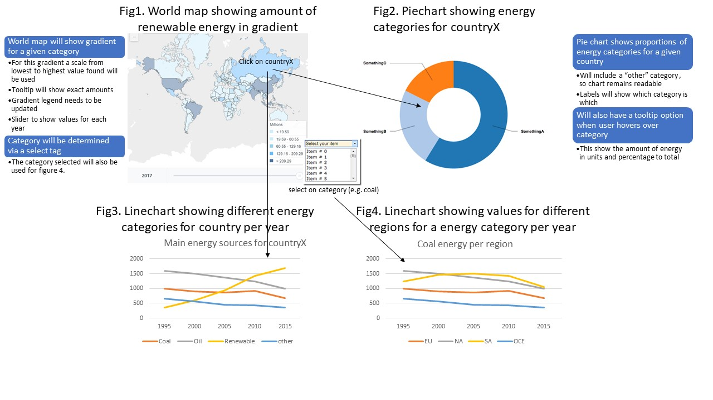

# Design doc
### Credentials:
* Mark van Malestein
* 10807640
* markmalestein@gmail.com

## Datasource:
The dataset from [this site](https://www.kaggle.com/unitednations/international-energy-statistics) will be used. This dataset is, however, very large, so preprocessing is needed. I plan to do the preprocessing in python. I'm going to exclude the data that is interesting for my project and form 5 different categories based on the [UN guidlines](data/Energy-Questionnaire-Guidelines.pdf) for these statistics. When preprocessing is done each row will consist of the following data:
* Year
* Country
* Category
* Amount
* Region ID
* Tooltip information

## Transformations:
The selections to be made will be as following:
* Coal, peat and oil shale
* Oil
* Natural gas, manufactured gas and recovered gas
* Electricity and heat
* Biofuels and waste

For preprocessing the following steps will need to be taken:
* Using pandas: group each country in a dataframe and sort years for each sort
* Add sources within each group, such as wind, solar, nuclear, hydro, etc for the electricity group (following given guidelines). Filter missing data
* Save 5 categories in JSON format
* Add a column with region ID for figure 4
* Add a column with amounts of subcategories (wind, solar, nuclear, etc.), this will be useful for the piechart tooltip.

## Methods:
### Preprocessing methods:
#### load_csv()
Here csv will be loaded with pandas and returned to create_categories()
#### create_categories()
Here different commodities will be selected and added to the correct category, also information will be saved in an extra column. Finally, missing data will be given a None value. Dataframe will be returned to add_id().
#### add_id()
Now a region id will be added to each row. This will result in yet an extra column. Dataframe will be returned to write_json().
#### write_json()
Writes the preprocessed data to JSON-file.
### Initialization of page:
#### loadJson()
The JSON-file is loaded and saved to a global variable.

#### initializeChartContainers()
The chart containers are called, and the layout of the page is determined.

#### makeMap()
Shows worldmap with a gradient. The gradient represents the amount of a given category. For this worldmap I will need to implement the datamaps library. Countries can be clicked.

#### makePie()
Shows amounts per categories in a piechart for a given country. When hovering over the “Tooltip information” will be shown. Pie-slices (categories) can be clicked.

#### makeLineCategory()
Shows lines representing the amount of energy production over time. The content of this figure is dependent on the worldmap.

#### makeLineRegion()
Shows lines representing the amount of 1 category for each region over time. The content of this figure is dependent on the piechart.

Also helper functions such as calculateGradient(), extractData(), makeSelectTag() etc. will be used.
### Updating the pages:
#### reloadMap(), when the select tag is used
This function reloads the values for the world map. Also the gradient and legend are re-implied.

#### reloadPie(), when a country on the map is clicked
Reloads the piechart.

#### reloadLineCategory(), when a country on the map is clicked
This function reloads figure 3.

#### reloadLineRegion(), when the piechart is clicked
This function reloads figure 4.

## APIs and D3 plugins:
For this project no APIs are needed, since I've got a local csv file. The D3 plugins needed are d3.v5 (https://d3js.org/d3.v5.min.js) and [datamaps](https://github.com/markmarkoh/datamaps/releases/tag/v0.5.0).
