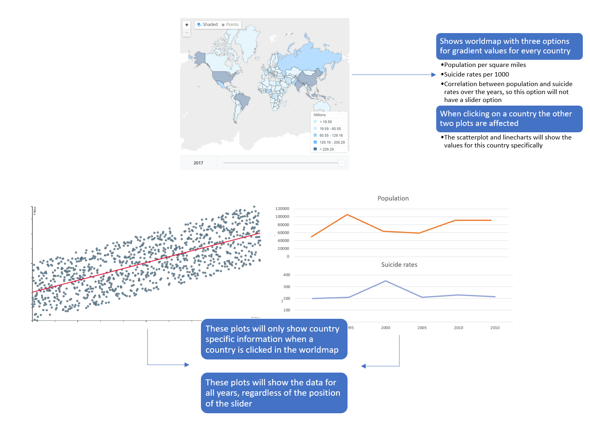

# Population and Suicide Visualized
##### Credentials
* Mark van Malestein
* 10807640
* markmalestein@gmail.com

### Problem
We all know the population is growing rapidly worldwide. However, the impact of this growth on our mental well-being is less clear. Even more so, when talking about 'far-away' countries and different cultures. 

### Solution
Vizualizing populations and suicides alone will not help with providing a clear picture. For this reason, I think a worldmap showing the correlation between growth in population and suicide rates is necessary for providing a clear picture. 

## Prerequisites
### Datasource:
* [This dataset](/olddata/population.csv) from [the world bank](https://data.worldbank.org/indicator/SP.POP.TOTL) which consists of the total population for every country from 1960 to 2016. Data from 1960 to 1989 will be excluded. 
* [This dataset](/olddata/suicide.csv) from [this page](https://ourworldindata.org/suicide) consists off suicide rates for every country from 1990 to 2016.
* Surface area's per country will be excluded from [this](https://raw.githubusercontent.com/underscoreio/csv-workshop/master/src/main/resources/countries.csv) dataset.

### Transformation:
* The total population of each will need to be divided that countries surface area.
* For convenience all data, population/suicide/surface will be combined in a new csv file.

### Libraries:
* [Datamaps](http://datamaps.github.io/) will be needed for the worldmaps.
* [D3js](https://d3js.org/) will be needed for the correlation plots and linecharts.

### Similar:
* The worldmaps with slider will be similar to [this](https://data.worldbank.org/indicator/SP.POP.TOTL?view=map) worldmap.
* A scatterplot for the average population per sqr miles and suicide rates would resemble [this](https://charts.animateddata.co.uk/whatmakesushappy/) plot.

### Hardest parts:
* Making the different charts co-interactive. So clicking a country on the worldmap will determine which data is being shown in the linecharts and scatter/correlation plot.
* Providing a "all countries" option, where the two linecharts and the scatter/correlation plot show all the data combined.
