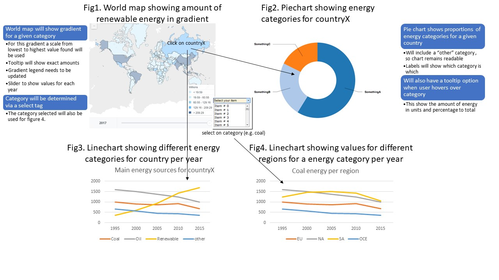

# Energy sources Visualized
##### Credentials
* Mark van Malestein
* 10807640
* markmalestein@gmail.com

### Problem
Nowadays, as the effects of climate changes become more and more visible, renewable energy is becoming an increasingly important source of energy. But how big is the contribution of renewable energy when compared to our total energy supply? Are 'outdated' energy sources such as oil and coal decreasing? In which countries are the most rapid changes being made?

### Solution
To answer questions like these and provide a clear picture on the current changes, we will apply different visualisation tools. These tools will be linked to provide an interactive page to work with and help answer all your questions concerning changes in energy source management.

## Prerequisites
### Datasource:
* [This dataset](/data/population.csv) from [the world bank](https://data.worldbank.org/indicator/SP.POP.TOTL) which consists of the total population for every country from 1960 to 2016. Data from 1960 to 1989 will be excluded. 
* [This dataset](/data/suicide.csv) from [this page](https://ourworldindata.org/suicide) consists off suicide rates for every country from 1990 to 2016.
* Surface area's per country will be excluded from [this](https://raw.githubusercontent.com/underscoreio/csv-workshop/master/src/main/resources/countries.csv) dataset.

### Transformation:
* The total population of each will need to be divided that countries surface area.
* For convenience all data, population/suicide/surface will be combined in a new csv file.

### Libraries:
* [Datamaps](http://datamaps.github.io/) will be needed for the worldmaps.
* [D3js](https://d3js.org/) will be needed for the correlation plots and linecharts.

### Similar:
* The worldmaps with slider will be similar to [this](https://data.worldbank.org/indicator/SP.POP.TOTL?view=map) worldmap.
* A scatterplot for the average population per sqr miles and suicide rates would resemble [this](https://charts.animateddata.co.uk/whatmakesushappy/) plot.

### Hardest parts:
* Making the different charts co-interactive. So clicking a country on the worldmap will determine which data is being shown in the linecharts and scatter/correlation plot.
* Providing a "all countries" option, where the two linecharts and the scatter/correlation plot show all the data combined.

