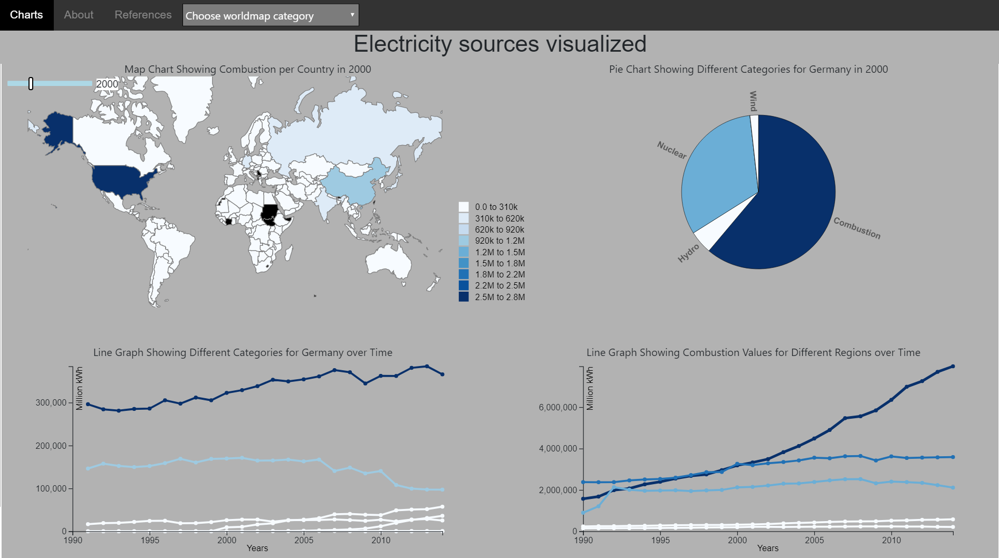
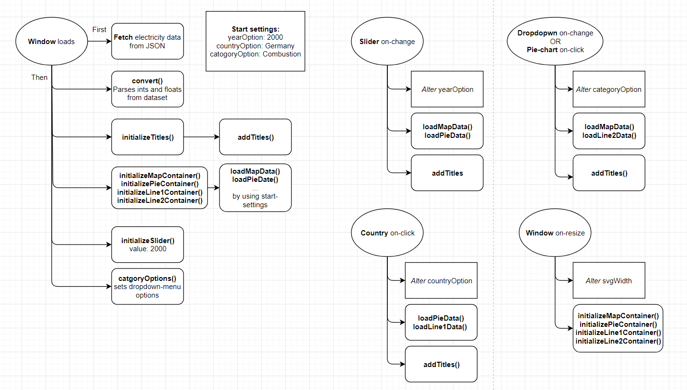

# Description
This project shows the change in sources of electricity production. It does so, by showing changes in sources per country (worldmap), per region (line-chart), in relationship to eachother (pie-chart) and over time (line-chart).  
Three settings are used to specify which data is shown:
* Country: by clicking a country on the worldmap.
* Year:  by using the year-slider.
* Energy-source: by using either the dropdown-menu or clicking on the pie-chart.

# Design
## High-level overview
There are six situations where functions are called:
* The window loads
* The window-size is adjusted
* Dropdown menu is used
* Year-slider is used
* A slice of the pie-chart is clicked (same effect as dropdown-menu)
* A country of the worldmap is clicked

These actions are represented in the flowchart below.

## Function descriptions
### Initialisation functions:
* initializeMapContainer()
  * Initializes worldmap svg and country-paths (via json)
  * Calls loadDataMap()
* initializePieContainer()
  * Initialized pie-chart svg
  * Calls loadDataPie()
* initializeLine1Container()
  * Initializes container for linechart showing values for different categories for one country over time
  * Calls loadDataLine1()
* initializeLine2Container()
  * Initializes container for linechart showing values for differen regions for one category over time
  * Calls loadDataLine2()
* initializeSlider()
  * Initializes range input element
* categoryOptions()
  * Sets options for dropdown-menu
* initializeTitles()
  * Initializes divs for titles

### Update functions:
* loadDataMap()
  * Loads specific values (based of categoryOption and yearOption)
  * Add color, tooltip, legend
  * Adds on-click funtion to change countryOption
* loadDataPie()
  * Loads specific values (based of yearOption and countryOption)
  * Add color, tooltip, labels and transition
  * Adds on-click function to change categoryOption
* loadDataLine1()
  * Loads specific values (based of countryOption)
  * Adds color, lines, tooltips and transition
* loadDataLine2()
  * Loads specific values (based of categoryOption)
  * Adds color, lines, tooltips and transition
* addTitles()
  * Appends text to title-divs

 ### Helper functions:
 * filterData()
   * Isolates chart-specific data from the main data array and returns it as an array of objects
 * getValues()
   * Extracts quantative values from an array of objects and returns it as an array.
 * convert()
   * Converts numeric strings to ints and floats
   * Returns nothing
 * getMaxValue()
   * Returns highest value in an array of objects
 * getMeanValue()
   * Returns mean of values in an array of objects
 * colorFunction()
   * Takes 1 datapoint value and 1 maximum value
   * Returns correct color from gradient
   
# Challenges and Decisions
##### Finding data
When writing the proposal I came up with two datasets which I thought were interesting to look at. However, these didn't provide me with enough data to answer the questions I proposed. So, last minute I decided to use the electricity dataset, which complex enough for this project, but less interesting.

##### Implementing borders
I wanted to implement borders around each chart container to make the page more appealing, but I couldn't make them look neat. So I decided not to apply them.

##### Implementing bootstrap
This took me a lot of time to fully understand and implement. But, I'm glad I did, because the page looks very well ordered when resizing the browser window.

##### Linecharts: legend or hover-over?

# Decisions
no legend in linecharts but color-gradient/tooltips. More dynamic less clear
choose for seperate pages (chart page remains ordered and tidy), interactions/functionalities less obvious
implementing same colorgradient for all charts. Organized look, but line/piechart less obvious which data is which

# Credentials

